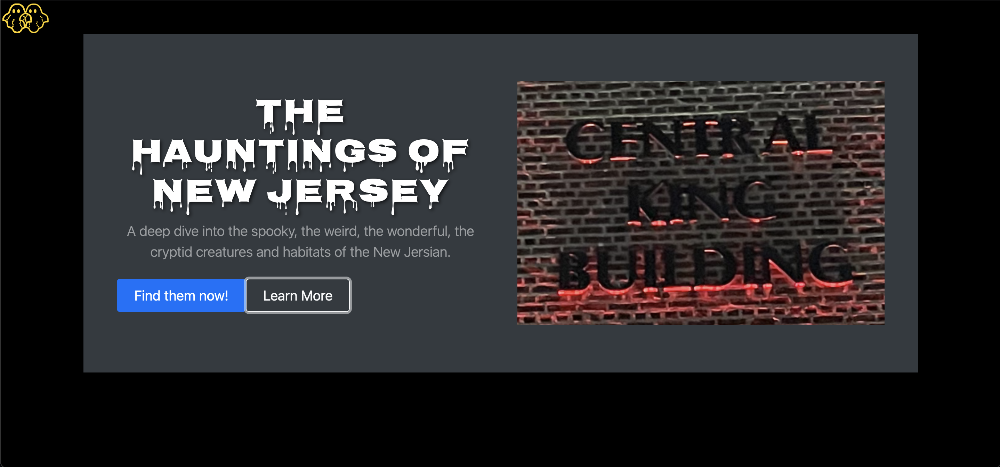
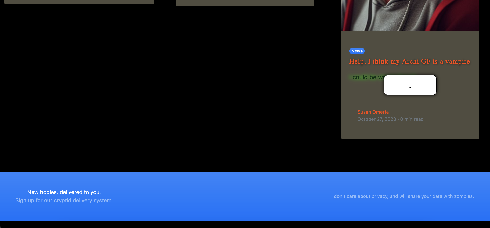
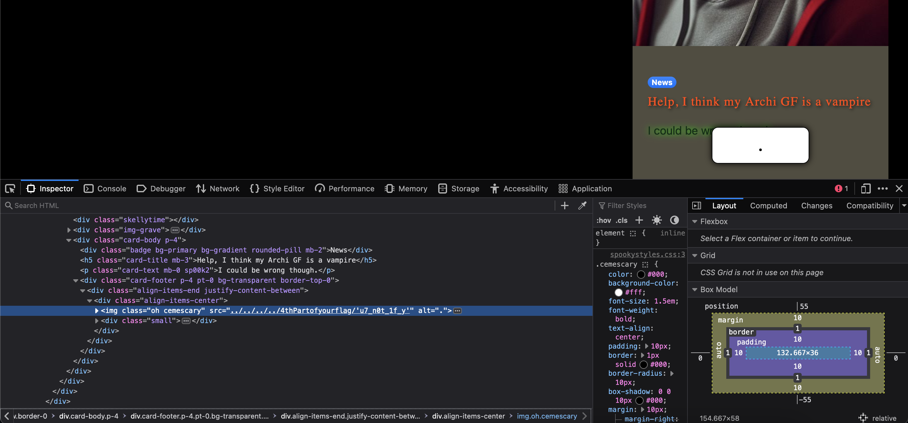
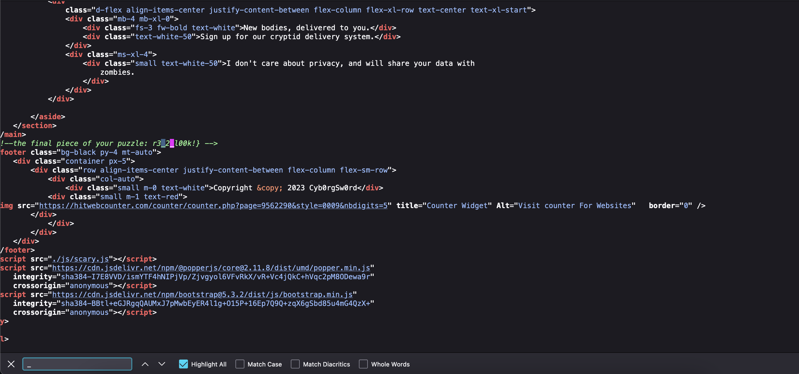
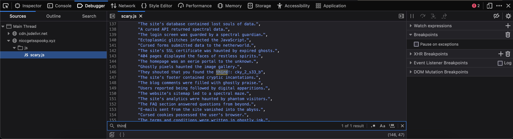
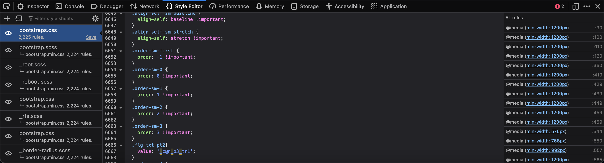
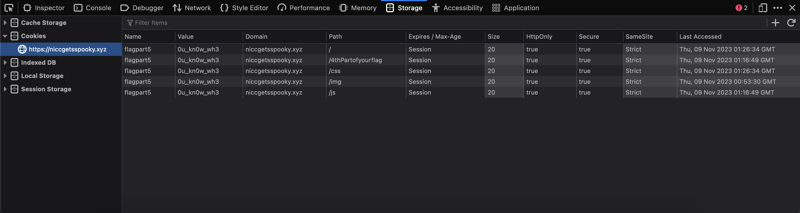

# Ghosts in the Code
Writeup Author: nazareth
## Description
* Author: Cyb0rgSw0rd
* Category: web

Some student here spun up a site where people are submitting their stories about all of the spooky stuff on campus!

This site is clearly haunted... or, at the very least, cursed.

https://niccgetsspooky.xyz

Flag Format: NICC{w0rds_may_c0nta1n_nums_and_chars!?} - but there are no apostrophes, commas, for colons

## Writeup
Upon navigating to the url in the challenge description, we see two buttons:

The first part of the flag is found simply by clicking the `Learn More` button.

Next, I thought it would be most sensible to continue clicking around the webpage to see if I could find any part of the flag that way. Sure enough, I got to the bottom of the page and saw this weird white box with a period in it, covering other parts of the webpage:

When I right-clicked the "period element" and then `Inspect`, I saw that the image source is a file path. The file path says that the fourth part of the flag is the filename! So, at this point, I had part 1 and part 4 of the flag.

Next, I decided to view the page source and ctrl-f for flag characteristics. First, I searched for "flag" and didn't find anything significant. Then, I searched for underscores and found the final part of the flag in a comment at the bottom of the source:

So, at this point, I had part 1, 4, and the final part of the flag.

Next, I decided to investigate the javascript by right-clicking the web page, clicking `Inspect`, and then clicking the `Debugger` tab where I navigated through the niccgetsspooky.xyz related dropdowns to find the non-imported .js file. I did ctrl-f for flag characteristics again with "flag" and "_" returning nothing interesting. So, I decided to search for "second", looking for the second part of the flag. No luck. Then, I tried "third" and found what appeared to be the third part of the flag:

So, at this point, I had part 1, 3, 4, and the final part of the flag.

Next, I decided to look in the .css files. To access them, I right-clicked the web page, clicked `Inspect`, and then clicked the `Style Editor` tab. I decided to continue with my ctrl-f method in these .css files; I did ctrl-f and searched for "_" and found part two of the flag!

So, at this point, I had part 1, 2, 3, 4, and the final part of the flag.

I wasn't sure if there were any additional parts of the flag, so I assembled the flag pieces: `NICC{gh0sts_c@n_b3_tr1cky_2_s33_bu7_n0t_1f_yr3_2_l00k!}` The flag forms a sentence but seems unreadable at the end: `_yr3_2_l00k!}` I guessed that there was probably one more part of the flag in order to make the flag a readable sentence.

I decided to checkout the cookies by right-clicking the web page, clicking `Inspect`, clicking the `Storage` tab, and clicking the `Cookies` dropdown menu. The value of the cookie happened to be the fifth part of the flag:

Now, the assembled flag was readable and correct when I submitted it.

Flag: `NICC{gh0sts_c@n_b3_tr1cky_2_s33_bu7_n0t_1f_y0u_kn0w_wh3r3_2_l00k!}`