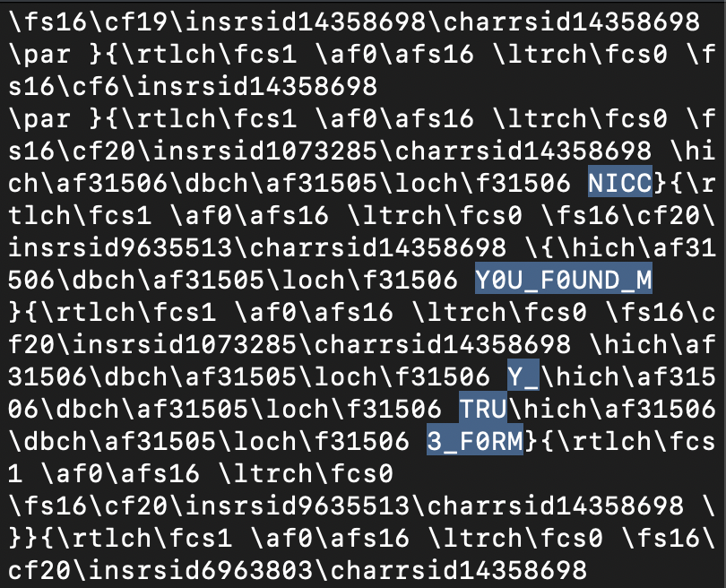

# shapeshifter
Writeup Author: nazareth
## Description
* Author: theamazins17
* Category: misc

I lost my flag and I can't seem to find it. I know I put it in this folder, but it is not showing up.

Can you help me find it?

**File-to-download:** [distant-figure.png](https://github.com/TrojanHorses-CTF/trojanhorse-writeups/blob/main/writeups/SpookyCTF_2023/shapeshifter/distant-figure.png)

## Writeup
First, I downloaded `distant-figure.png` and tried to open it via my computer's GUI. However, I received this error: `The file “distant-figure.png” could not be opened. It may be damaged or use a file format that Preview doesn’t recognize.`

My initial reaction to that error was the following: "I bet the file isn't actually a png." So, in order to verify that hypothesis, I ran the `file` command on `distant-figure.png`. Sure enough, the output reported that it was a zip file.

So, I ran `$ unzip distant-figure.png` to unzip the file and a directory named `distant-figure` was created. I ran `ls` on the directory, and it revealed one file in the directory contents: `true-form.exe`

Then, I decided to try running `true-form.exe` (I know that's usually a bad idea lol). The file would not run.

My next step was to `vim` the file and search for flag characteristics, specifically `NICC` which is the prefix to the flags for this competition.

I found NICC and began looking at the strings around it. There were four other strings that caught my eye, appearing to be parts of a flag *especially* because they formed a sentence: "Y0U_F0UND_MY_TRU3_F0RM"

So, I added the `NICC` prefix and curly braces and submitted the resulting flag...which was correct!

Flag: `NICC{Y0U_F0UND_MY_TRU3_F0RM}`