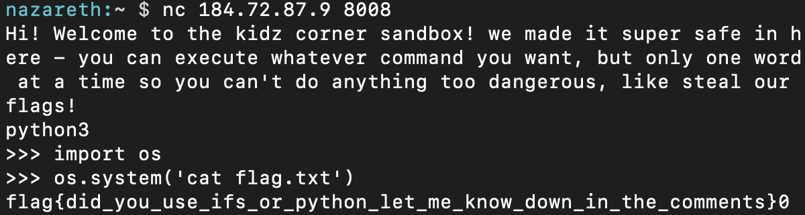

# sandbox
Writeup Author: nazareth
## Description
* Category: kidz-corner

I "made" "a" "python" "sandbox" """"

nc 184.72.87.9 8008

## Writeup
When I ran the `nc` command in the description, a shell was returned with the following prompt:
```
Hi! Welcome to the kidz corner sandbox! we made it super safe in here - you can execute whatever command you want, but only one word at a time so you can't do anything too dangerous, like steal our flags!
```

The first thing I did was run `$ ls`. Two files were present: `flag.txt` and `sandbox.py`.

Naturally, I tried to run `$ cat flag.txt`. It returned nothing. I tried `$ vim flag.txt`. Still nothing. Clearly the "only one word at a time" in the prompt was true.

So, I began executing all the commands I could think of that were only one word i.e. that required no input. I eventually thought of `python3`.

I could run `$ python3` and enter a python shell. Then, I could execute bash commands from the python shell via the `os` module. This allowed me to `cat` the flag.



Flag: `flag{did_you_use_ifs_or_python_let_me_know_down_in_the_comments}`